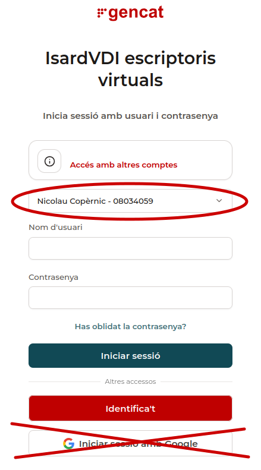

# Isard

Isard és l'escriptori virtual del Departament d'Educació. Permet accedir, des de qualsevol navegador, a màquines virtuals que podràs necessitar en pràctiques o exàmens.

## Accés

**[elmeuescriptori.gestioeducativa.gencat.cat](https://elmeuescriptori.gestioeducativa.gencat.cat/login)**

- **Login**: usuari i contrasenya **d'Educació** (`identificador@edu.gencat.cat`).
- La primera vegada que hi accedeixis, **et demanarà un codi** (que et vincula amb el curs que estàs fent). Aquest codi te l'ha de facilitar el tutor.

!!! danger "No entris mai amb el compte de Google"
    A la pantalla de login, no facis servir mai l'opció d'entrar amb un compte de Google. Selecciona sempre l'opció d'entrar amb el **login i contrasenya d'Educació**, i tria l'**Institut Nicolau Copèrnic** com a centre.

<figure markdown="span">
  { width="80%" }
  <figcaption>Pantalla d'accés a Isard.</figcaption>
</figure>

!!! info "Contingut pendent"
    Aquesta pàgina s'anirà completant amb el procediment d'ús bàsic i les incidències habituals.
