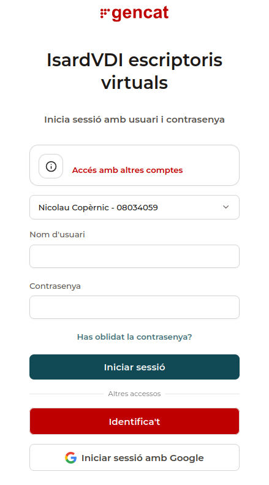

# Webs d'ús habitual

Aquesta pàgina recull les pàgines i portals web que faràs servir més sovint durant el curs.

## Webs del dia a dia

### 1. Pàgina web de l'Institut

**[www.copernic.cat](https://www.copernic.cat)**

Web amb la informació general de l'Institut.

!!! tip "Recursos i documents habituals"
    Dins d'aquesta web és especialment important la secció [Recursos i documents habituals](https://www.copernic.cat/ca/recursos-i-documents-habituals), on trobaràs models de documents que et poden fer falta durant el curs, com ara:

    - Acta elecció delegat/ada
    - Sol·licitud vaga alumnes
    - Drets i deures de l'alumnat
    - Sol·licitud baixa mòduls
    - Sol·licitud de canvi de torn
    - Sol·licitud semipresencialitat
    - Sol·licitud sortir d'hora
    - Sol·licitud de convalidació directa de centre de mòduls professionals de cicles formatius

### 2. Moodle del centre

**[cv.copernic.cat](https://cv.copernic.cat)**

Portal del campus virtual del centre. Hi trobaràs els mòduls en què estàs matriculat, amb el material corresponent i les activitats proposades a classe.

- **Login**: usuari i contrasenya **de centre**.

### 3. iEduca

**[copernic.ieduca.com](https://copernic.ieduca.com/)**

Portal des d'on pots consultar l'estat de la matrícula, els mòduls en què estàs inscrit i les qualificacions que aniran al teu expedient acadèmic.

- **Login**: usuari i contrasenya **de centre**.

## Webs per al treball a l'aula

### 1. Isard

**[elmeuescriptori.gestioeducativa.gencat.cat](https://elmeuescriptori.gestioeducativa.gencat.cat/login)**

Portal al núvol on trobaràs les màquines virtuals que pots necessitar en exercicis pràctics o exàmens.

- **Login**: usuari i contrasenya **d'Educació**.

!!! danger "No entris mai amb el compte de Google"
    A la pantalla de login, no facis servir mai l'opció d'entrar amb un compte de Google. Selecciona sempre l'opció d'entrar amb el **login i contrasenya d'Educació**, i tria l'**Institut Nicolau Copèrnic** com a centre.

<figure markdown="span">
  { width="80%" }
  <figcaption>Accés a Isard.</figcaption>
</figure>

### 2. qBittorrent

**[qbittorrent.copernic.cat](https://qbittorrent.copernic.cat/)**

Aquest portal està allotjat als servidors del propi Institut i conté programari i imatges ISO que pots necessitar durant les pràctiques.

!!! warning "Descarrega sempre des d'aquest portal"
    Quan necessitis algun d'aquests recursos, descarrega'l sempre des d'aquí i no des d'una pàgina equivalent a Internet. Com que aquest portal es troba dins la xarxa del centre, la descàrrega es fa per la xarxa interna i no consumeix l'ample de banda d'Internet del centre.
